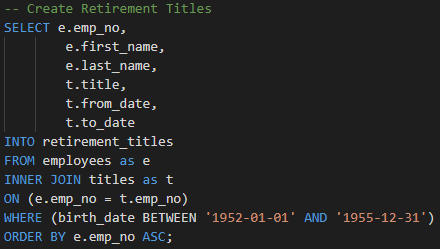

# Pewlett Hackard Analysis

## Overview
Determine the quantity of employees that will be retiring in order to establish the retirement package that is going to be offer across the eligible employees and define the new positions that need to be filled as a result of the job openings within the Pewlett Hackard company.

## Results
- Retirement Titles
This table is gathering the information of all employees with their titles. In order to do that, the table of employees is joining with the table of titles.

- Unique Titles
This table removes the duplicate employees who have been in more than one position throughout the company's time. It reduces and gives a more realistic number of employees.

- Retiring Titles
This table group and count the retiring employees by title shows a clear picture of how many retirement packages and job openings will be needed.

- Mentorship Eligibility
This table takes data from three different tables, employees, dept_emp, and titles, and all three join in one table filtering by employees born in 1965 who are eligible for the mentorship program.

## Summary
The total number of employees will be retiring, 90,398.

The number of employees eligible for the mentorship program is 1,940. 

We can see that the majority of the jobs that need to be filled are in the Senior Engineer level follow by Senior Staff and Engineer; the fewer positions to be filled are Manager level counting with two and Assistant Engineer are among the less needed. All this is based on the number of employees by title to be retired.

